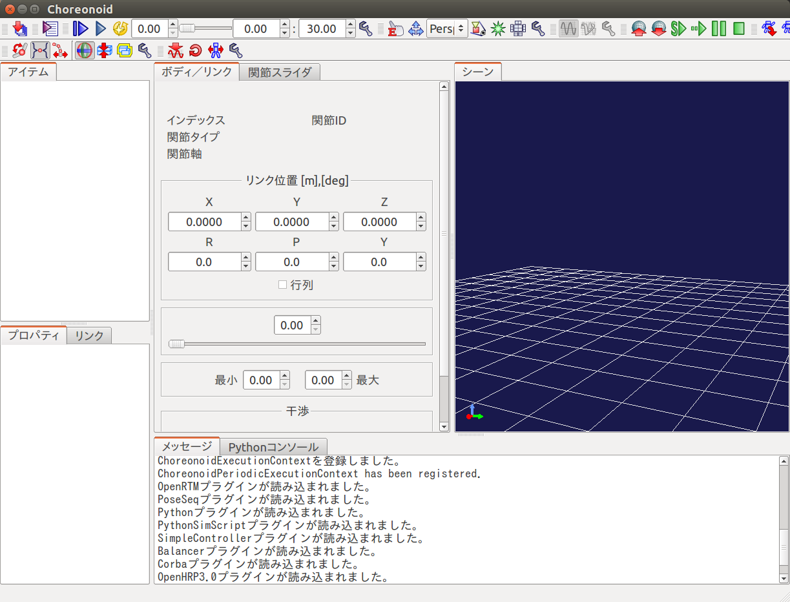
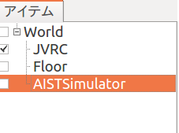
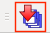

Creating a simulation project
=============================

This chapter explains how to create and run a simple simulation.

Launch Choreonoid
-----------------

Let's launch Choreonoid first. Type the following command in gnome-terminal.

.. code-block:: bash

 $ choreonoid

You will see a window as follows.

Open a model file
-----------------

Create a world item named "World" first by selecting "File", "New..." and "World" menus.

Then load a model file of JVRC-1 by choosing "OpenHRP Model File" followed by "File", "Open..." menus. The filename is ~/catkin_ws/install/share/jvrc_models/model/JVRC-1/main.wrl.

.. note::

   Make sure the model file is located under lower level of the "World" item.
   Parent and child relationships of items have measure importance to define simulation setting in Choreonoid.
   If the item is not in the desired location, you can drag and drop the item to adjust the location.

When you check the checkbox named "JVRC", JVRC-1 will be displayed in the scene view as follows.

.. image:: images/model.png

Add a model of the floor
------------------------

To prevent the robot from falling, let's add a model of the ground.

The window of Choreonoid has a tab named "Items". This tab is called "item view". Select "World" item first in the item view. Then choose "OpenHRP Model File" following "File","Open..." menus and select the model file for the floor. Its filename is ~/catkin_ws/devel/share/choreonoid-1.5/model/misc/floor.wrl.

Add a simulator item
--------------------

Choose "World" item in the item view. Then create a "AISTSimulator" item by following "File", "New..." menus.

Specify initial state of simulation
-----------------------------------

By set the initial position and attitude of the robot to the project file, we can start the simulation in specified state even after we restart the Choreonoid.
Setting of initial state can be applied as follows:

1. Position and attitude of the root link of the robot can be edited in Body/Link view.

   .. image:: images/body_link_view.png

2. Joint angles can be edited in Joint slider view.

   .. image:: images/joint_slider_view.png

3. You can also edit the position and attitude visually using scene view.
   To do visual editing, please switch the scene view to edit mode.
   
4. Finally, press the "Store body setting to the initial world state" button on the simulation bar,

   .. image:: images/simubar_save_world.png

   And don't forget to save the project. Choose "Save Project As" menu in "File" menu and name the project file.

Basic simulation settings (time step, simulation time, integration mode, friction)
----------------------------------------------------------------------------------

Time step
#########

For time step, 1[ms] is recommended.
Time step is trade off to computational cost and preciseness of the simulation.
We also have to define this value under consideration with execution period of controller.

1. Press the setting button on the time bar.

   .. image:: images/timebar_config.png

2. Set internal frame rate to "1000"(=1ms) in the setting dialog.
       
   .. image:: images/timebar_config_framerate.png

Simulation time
###############

* Unlimited

  1. Select "AISTSimulator" item in the item view.

  2. Double click on the "time range" property on the property view to change the setting.

     .. image:: images/property_timerange.png

* Within time bar range

  1. Select "AISTSimulator" item in the item view.

  2. Double click on the "time range" property on the property view to change the setting.

     .. image:: images/property_timebarlimit.png

  3. Configure the start time and end time on the time bar.
     
     .. image:: images/timebar_timelimit.png

.. * 実時間同期

Integration mode
################

You can select either Runge Kutta method or Euler method to solve the differential equation in physics simulation.
Use of Runge Kutta method is recommended, because it can calculate higher order equation more precisely, while Euler method can only handle first order equation theoretically.

To set the integration mode, click on the AISTSimulator item and change the parameter in the property view.

.. image:: images/property_integrationmode.png

Friction
########

For frictions between the contacted objects, we can set "static friction" and "slip friction" parameters.
Static friction is applied when objects are not moving in between.
Slip friction is applied when objects are moving in between.

All the objects in the world are applied with the same friction parameters.

To set the friction parameters, click on the AISTSimulator item and change the parameters in the property view.

.. image:: images/property_friction.png

Enable cameras and range sensors
--------------------------------

To enable cameras and range sensors in simulation, do the following settings.

Select AISTSimulator in the item view and create a GLVisionSensorSimulator item and name it GLVisionSimulator.

.. image:: images/vision.png

.. note::

  If "Target bodies" and "Target sensors" properties are empty, all the sensors exist in the simulation world will be simulated. You can improve the simulation speed by only simulating specified sensors by specifying the target sensors on the property. Within this example, ranger sensor of JVRC robot is specified as target, cameras on the robot body is ignored.

  .. image:: images/vision_property.png

Run simulation
--------------

Next press "Start simulation from the beginning" button in the simulation tool bar. Simulation will start.

.. image:: images/simulation_start.png

Just after starting simulation, the robot falls down.

.. image:: images/simulation_no_controller.png

Because all joints are not controlled but free.

Update a project
----------------

After running simulation, let's update the project. press the "Save the project" button on the file bar.
update the project in currently status.

.. toctree::
   :maxdepth: 2

